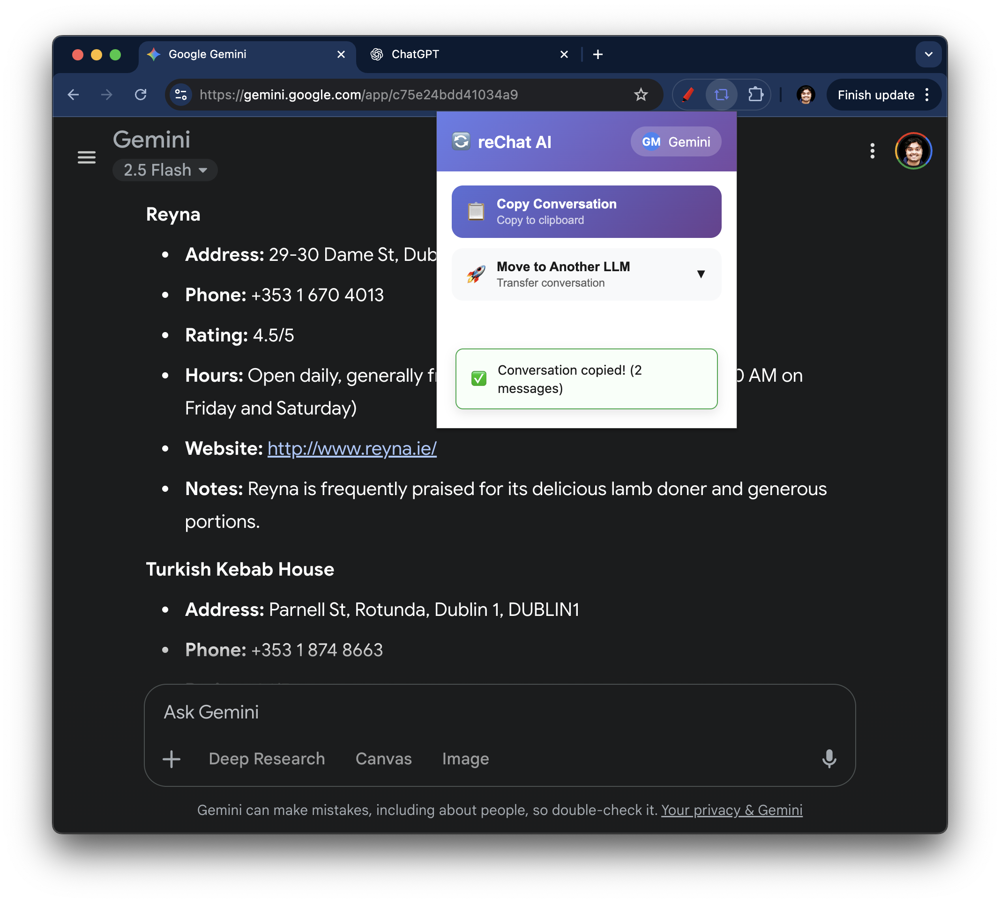
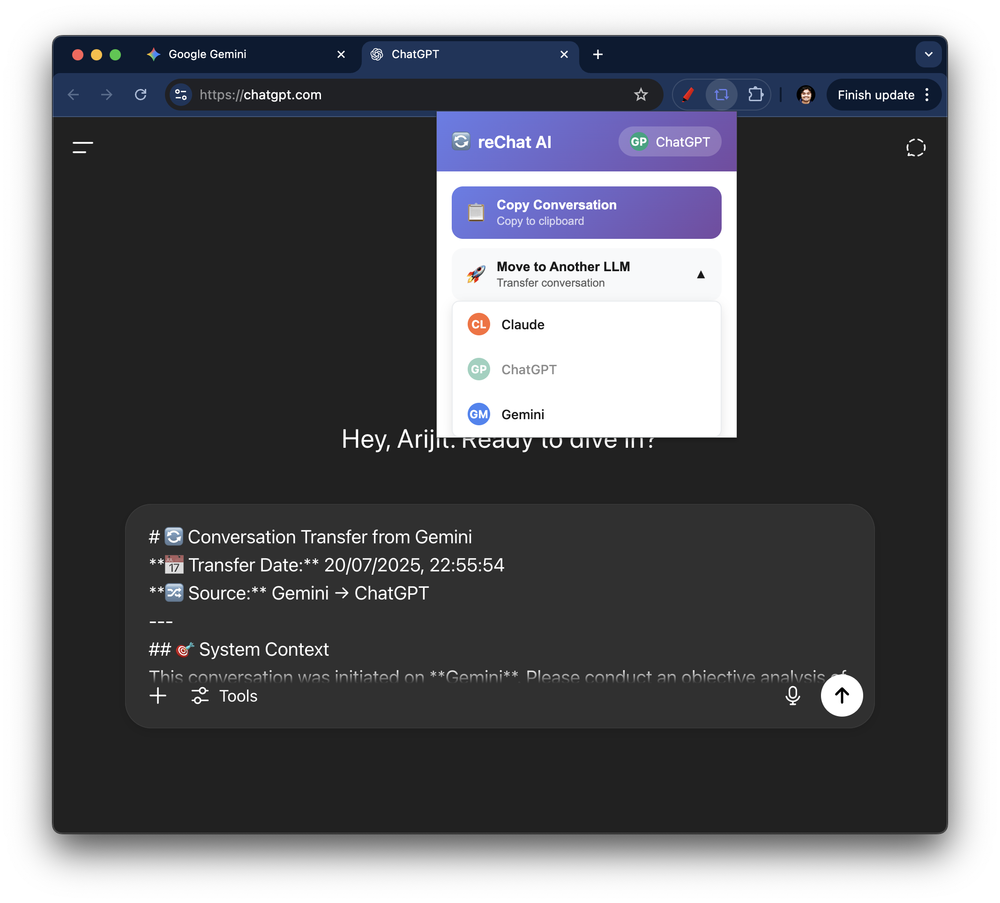

# reChat AI

A simple Chrome extension to move conversations between LLMs (Claude, ChatGPT, Gemini).

## Screenshots


*Extension popup showing copy conversation feature*


*Example of conversation being transferred between LLMs*

## Features

- **Copy Conversation**: Extract and copy conversation to clipboard
- **Move Conversation**: Transfer conversation directly to another LLM
- **Smart Formatting**: Preserves conversation structure and context

## Supported LLMs

- **ChatGPT** (chatgpt.com) - ✅ Full Support
- **Gemini** (gemini.google.com) - ✅ Full Support  
- **Claude** (claude.ai) - 🚧 Work in Progress

## How to Use

1. **Install the Extension**
   - Load unpacked extension in Chrome Developer Mode
   - Navigate to `chrome://extensions/`
   - Enable "Developer mode" and click "Load unpacked"
   - Select the `rechat-ai` folder

2. **Copy Conversation**
   - Go to any supported LLM conversation
   - Click the reChat AI extension icon
   - Click "Copy Conversation"
   - Paste anywhere you need the formatted conversation

3. **Move Conversation**
   - Go to any supported LLM conversation
   - Click the reChat AI extension icon
   - Click "Move to Another LLM"
   - Select target LLM (Claude/ChatGPT/Gemini)
   - Extension opens new tab and pastes conversation

## File Structure

```
rechat-ai/
├── manifest.json           # Extension configuration
├── background/
│   └── background.js       # Service worker
├── content-scripts/        # LLM-specific extractors
│   ├── claude.js
│   ├── chatgpt.js
│   └── gemini.js
├── popup/                  # Extension popup UI
│   ├── popup.html
│   ├── popup.css
│   └── popup.js
└── utils/                  # Shared utilities
    ├── constants.js        # LLM configurations
    └── formatter.js        # Conversation formatter
```

## Privacy

- **No data storage**: Extension is completely stateless
- **No external requests**: All processing happens locally
- **No tracking**: No analytics or telemetry

## License

MIT License
